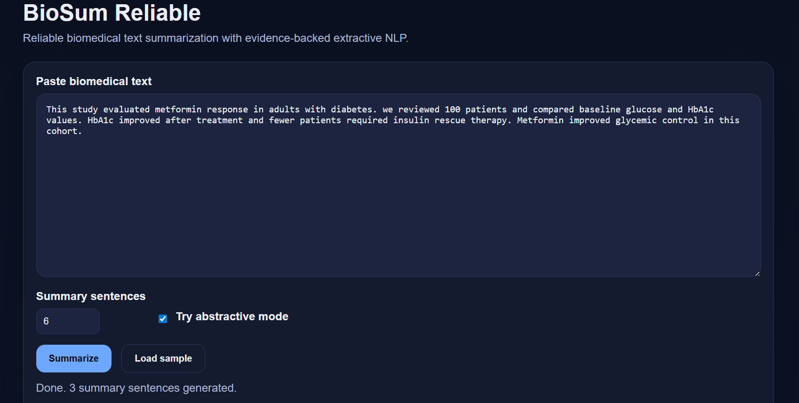
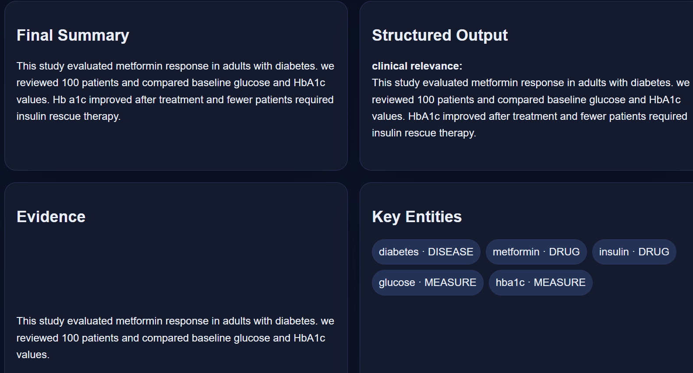
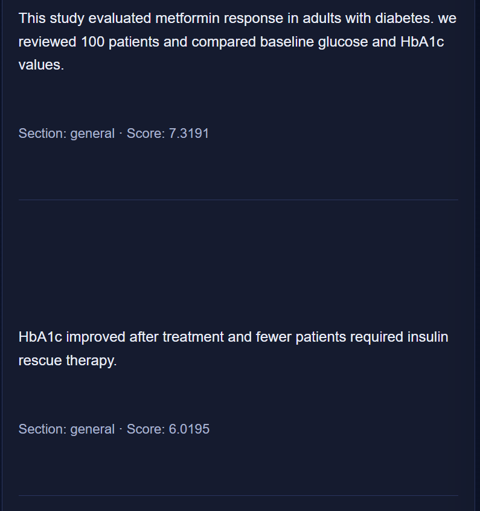
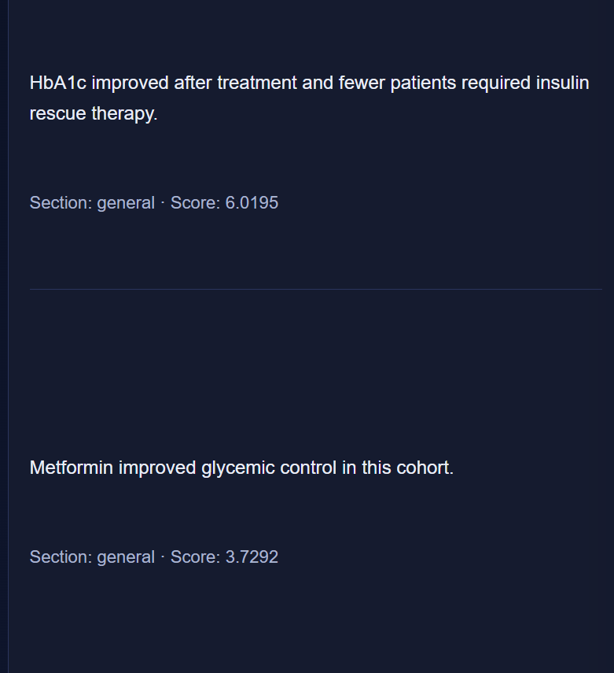

# BioSum Reliable


[](https://huggingface.co/spaces/saloni-1919/biosum-reliable)

An AI-powered biomedical text summarization system that produces structured, evidence-backed insights from research literature.

BioSum Reliable is an intelligent biomedical NLP system that converts complex research documents into structured summaries. The system combines **extractive NLP**, **transformer-based abstractive summarization**, and **biomedical entity recognition** to produce interpretable and evidence-supported summaries of biomedical literature.

---

## Demo

🚀 Live Demo
👉 https://huggingface.co/spaces/saloni-1919/biosum-reliable 

OR 

Watch the Video! 

<p align="center">
  
</p>

### Web Interface



---

## Key Features

- Evidence-based extractive summarization  
- Transformer-based abstractive summarization  
- Biomedical entity recognition  
- Structured research summaries (Objective, Methods, Results, Conclusion)  
- Evidence scoring for transparency  
- REST API with FastAPI  
- Interactive Swagger API documentation  
- Docker-ready deployment  

---
## Use Cases

BioSum Reliable can be used in several biomedical and research workflows:

- Summarizing biomedical research papers
- Extracting key findings from clinical studies
- Supporting literature review for researchers
- Assisting medical professionals in reviewing research
- Integrating biomedical summarization into AI pipelines

---
# Example Output

### Structured Research Summary

**Objective**

This study evaluated metformin response in adults with diabetes.

**Methods**

We reviewed 100 patients and compared baseline glucose and HbA1c values.

**Results**

HbA1c improved after treatment and fewer patients required insulin rescue therapy.

**Conclusion**

Metformin improved glycemic control in this cohort.

---

### Extractive Summary

Important sentences selected directly from the research document using statistical scoring and biomedical heuristics.

---

### Final Summary

A refined summary generated using a transformer model trained on biomedical literature.

---

### Key Biomedical Entities

Example extracted entities:

- Disease: Diabetes  
- Drug: Metformin  
- Drug: Insulin  
- Measure: HbA1c  

### Example System Output

<p align="center">
  
  
  
</p>

---

# System Architecture

BioSum Reliable processes biomedical text through several NLP stages.

1. Input biomedical research text  
2. Sentence segmentation and preprocessing  
3. Biomedical entity extraction  
4. Evidence-based sentence scoring  
5. Extractive summarization  
6. Transformer-based abstractive summarization  
7. Structured summary generation  
8. Final summary with supporting evidence  

---

# Technology Stack

- Python  
- FastAPI  
- PyTorch  
- HuggingFace Transformers  
- spaCy NLP  
- Uvicorn ASGI Server  

This project demonstrates a production-style **machine learning pipeline combining NLP, transformer models, and API deployment.**

---

## Running the Project

### Clone the repository

```bash
git clone https://github.com/saloni-1919/biosum-reliable.git
cd biosum-reliable
```
## Install Dependencies

Install all required Python packages using the requirements file.

```bash
pip install -r requirements.txt
```
## Run the API Server

Start the FastAPI application.

```bash
uvicorn app.main:app --reload
```
## Open the API Documentation

Once the server starts, open your browser and navigate to:
```text
http://127.0.0.1:8000/docs
```
This will open the interactive **Swagger API interface** where you can test the summarization API.

## Example API Request

### Endpoint
```text
POST /api/summarize
```

### Example Request Body

```json
{
  "text": "Biomedical research text...",
  "target_sentences": 5,
  "abstractive": true
}
```
### Example Response Includes

- Structured summary  
- Extractive summary  
- Final summarized output  
- Key biomedical entities  
- Evidence-ranked sentences

---
## Project Structure
```text
biosum-reliable
│
├── app
│   ├── api
│   ├── core
│   ├── ml
│   ├── services
│   └── main.py
│
├── docs
│   ├── demo.gif
│   ├── interface.png
│   ├── output1.png
│   ├── output2.png
│   └── output3.png
│
├── tests
├── LICENSE
├── Dockerfile
├── Procfile
├── pyproject.toml
├── requirements.txt
└── README.md
```
---
## Model Training
Note: Model weights are excluded from the repository due to GitHub file size limits. The model can be reproduced using the training script above.

The abstractive summarization component was trained using a **transformer-based model** on biomedical research literature.

### Dataset

**PubMed Scientific Papers Dataset**

### Base Model

**BART Large CNN**

### Training Configuration

| Parameter | Value |
|-----------|-------|
| Training samples | 200 |
| Validation samples | 50 |
| Epochs | 1 |
| Learning rate | 2e-5 |

### Training Results

- Final training loss: **2.57**
- Validation loss: **1.97**

### Reproduce Model Training

```bash
python app/ml/train_biomedical_summarizer.py
```
---
## Model Architecture

BioSum Reliable follows a hybrid summarization pipeline combining **extractive NLP techniques** with **transformer-based abstractive summarization**.

### Architecture Overview

The system processes biomedical research articles through the following stages:

1. **Text Input**
   - Biomedical research abstract or document is provided by the user.

2. **Preprocessing**
   - Sentence segmentation
   - Text normalization
   - Section detection (Objective, Methods, Results, Conclusion)

3. **Biomedical Entity Recognition**
   - Identification of domain-specific entities such as:
     - Diseases
     - Drugs
     - Clinical measurements
     - Treatments

4. **Evidence-Based Sentence Scoring**
   - Sentences are ranked based on relevance using statistical scoring.

5. **Extractive Summarization**
   - Top-ranked sentences are selected to produce an evidence-supported summary.

6. **Transformer-Based Abstractive Summarization**
   - A fine-tuned **BART model** generates a concise natural-language summary.

7. **Structured Research Output**
   - Results are organized into structured sections:
     - Objective
     - Methods
     - Results
     - Conclusion

8. **Evidence Transparency**
   - The system highlights supporting sentences used to generate the summary.

### Summarization Pipeline

```text
Biomedical Text
        │
        ▼
Sentence Segmentation
        │
        ▼
Biomedical Entity Recognition
        │
        ▼
Evidence Sentence Scoring
        │
        ▼
Extractive Summary
        │
        ▼
Transformer Abstractive Model (BART)
        │
        ▼
Structured Research Summary
```

### Output Components

The system generates multiple outputs for interpretability:

- **Structured summary** (Objective, Methods, Results, Conclusion)
- **Extractive summary**
- **Abstractive final summary**
- **Key biomedical entities**
- **Evidence-ranked supporting sentences**

This multi-stage architecture ensures both **interpretability** and **high-quality summarization** for biomedical literature.

---
## Future Improvements

- Train on larger biomedical datasets
- Improve entity recognition accuracy
- Add citation extraction
- Support full research paper summarization
- Deploy model using HuggingFace inference API

---
## License
This project is licensed under the **MIT License**.

See the [LICENSE](LICENSE) file for details.
---
## Author

**Saloni Nathani**  
GitHub: https://github.com/saloni-1919

